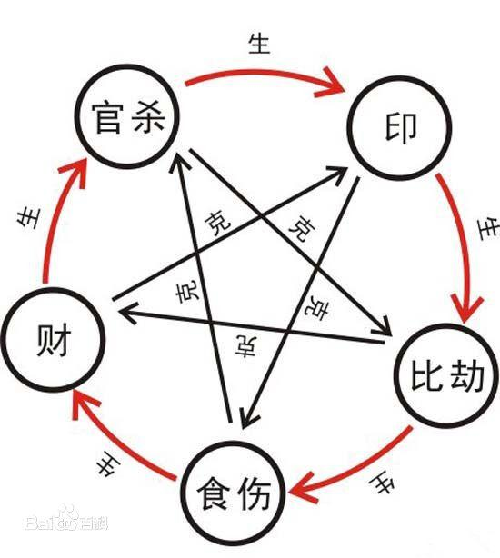

# 《子平真诠》

始于2021.6.23

在线阅读[地址](https://www.zhonghuadiancang.com/xuanxuewushu/zipingzhenquan/)

## 摘抄节选

### 凡例

> ...《子平大全》、《渊海子平》、《三命通会》、《神峰辟谬》等书，大都杂而不精，非初学所能读...

本书是最好入门的古籍，当然我是先通过网络上的教学视频找找感觉（多以b站为主，会发现每个人的知识都不太相同，可能派系的缘故，比如有的会把阳刃写成羊刃，比较靠谱的可能是“金水老师“这个up主），然后需要体系化的时候，再来看书。

另外，看这些古籍，也是需要循序渐进，《滴天髓》应该是最后再看的，可参考知乎上的这篇[文章](https://www.zhihu.com/question/22813176/answer/1271323998)

> 子平源于五星，名词格局，多沿五星之旧，后人不得其解，牵强附会，最足以淆乱耳目...

五星是什么？打错？五行？

> 《真诠》以月令用神为经，诸神为纬，然用神非尽出于月令，故于舍月令别取用神之格局，特别提出，加以说明。盖取用无定法，以月令用神编次，虽十得七八，究不能包括完备。此非原书之误，特限于编次之法，不得不然耳。

主打月令为用神，还会有月令无法取用神的情况

> 起例歌诀，无非便于记忆，若明其原理，则歌决不特容易记忆，且可自己编造，否则，命理歌诀多牛毛，焉能一一熟记？

古人说得很对，为什么非要背歌诀呢，每个人都有自己的记忆方法，只要记住就行

> 未习命理者，宜先阅末卷命理入门，再阅评注，循序而进，自不致毫无头绪。

末卷命理入门，当前在线书籍是没有的。网上搜索了一番，还是没找到，鉴于重要性不算太高，暂且搁置

### 一、论十干十二支

> 天地之间，一气而已。惟有动静，遂分阴阳。有老少，遂分四象。老者极动静之时，是为太阳太阴；少者初动初静之际，是为少阴少阳。有是四象，而五行具于其中矣。水者，太阴也；火者，太阳也；木者，少阳也；金者，少阴也；土者，阴阳老少、木火金水冲气所结也。

动静分阴阳，老少分四象；老少就是动静所处的阶段。

一般说五行的顺序是：木火土金水，对应的是少阳、太阳、冲气所结、少阴、太阴。去掉土，就是春夏秋冬。而且土应该是两季节过渡时出现的

> 有是五行，何以又有十干十二支乎？盖有阴阳，因生五行，而五行之中，各有阴阳。即以木论，甲乙者，木之阴阳也。甲者，乙之气；乙者，甲之质。在天为生气，而流行于万物者，甲也；在地为万物，而承兹生气者，乙也...

五行中的每项再分阴阳，阳为阴的气，阴为阳的质，私以为一个是精华，另一个是载体，两者相互依存，缺一个则不能成形（比如人）

会不会是，八字中阴性的天干地址较多的话，适合练体（没有明显冲克的条件下），相似的，阳性多的适合练气。当然最好的是阴阳调和的八字

> 何以复有寅卯者，又与甲乙分阴阳天地而言之者也。以甲乙而分阴阳，则甲为阳，乙为阴，木之行于天而为阴阳者也。以寅卯而阴阳，则寅为阳，卯为阴，木之存乎地而为阴阳者也。以甲乙寅卯而统分阴阳，则甲乙为阳寅卯为阴，木之在天成象而在地成形者也。甲乙行乎天，而寅卯受之；寅卯存乎也，而甲乙施焉。是故甲乙如官长，寅卯如该管地方。甲禄于寅，乙禄于卯，如府官之在郡，县官之在邑，而各司一月之令也。

天干行于天，地支存于地。在天成象而在地成形。天干地支也都可再分阴阳。

阳中阳，阳中阴，阴中阳，阴中阴

禄，是否就是临官？

> 以气而论，甲旺于乙；以质而论，乙坚于甲。而俗书谬论，以甲为大林，盛而宜斩，乙为微苗，脆而莫伤，可为不知阴阳之理者矣。

气与质的地位是等同的，各有优势，没有说一定强过另一方

阳中阳：气最旺

阴中阴：体最坚

### 二、论阴阳生克

> 然而有生又必有克，生而不克，则四时亦不成矣。克者，所以节而止之，使之收敛，以为发泄之机，故曰“天地节而四时成”。即以木论，木盛于夏，杀于秋，杀者，使发泄于外者藏收内，是杀正所以为生，大易以收剑为性情之实，以兑为万物所说，至哉言乎！譬如人之养生，固以饮食为生，然使时时饮食，而不使稍饥以待将来，人寿其能久乎？是以四时之运，生与克同用，克与生同功。

克也非常必要，而克的目的在于止、在于收敛，而不是置于死地。

养生这个例子，应该是想说不能总是保持饱腹感，应该吃饱后等待进入下一个饥饿的周期再进食

> ...秋天肃杀之气，逢阳和而克去，而人间之金，不畏阳和，此庚以丙为杀，而辛以丙为官也。人间金铁之质，逢薪传之火而立化，而肃杀之气，不畏薪传之火。此所以辛以丁为杀，而庚以丁为官也。即此以推，而余者以相克可知矣。

在本章节直接出现了十神：印，官，没接触过的估计比较懵逼。

这里很奇怪的是：

* 按照天干主气，地支主形的论述，人间之金应该是地支上的申酉
* 天干的丙丁，和天干的庚辛，是七煞的关系没错
* 奇怪的点在于举例用的是人间之金，应该距离为天上之金

十神的确立，是两者意象关系的一种表达，私以为知道天干的象征能方便了解十神知识

### 三、论阴阳生死

> 干动而不息，支静而有常。以每干流行于十二支之月，而生旺墓绝系焉。

生旺墓绝的由来：干支轮转组合

> 阳主聚，以进为进，故主顺；阴主散，以退为退，故主逆。此生沐浴等项，所以有阳顺阴逆之殊也。

生旺墓绝“阳顺着数，阴逆着数“的由来。用的就是十二长生

生旺墓绝对应十二长生关系？

生：长生 沐浴 冠带

旺：临官 帝旺 衰  

墓：病 死 墓

绝：绝 胎 养

> 木当午月，正枝叶繁盛之候，而甲何以死？却不是外虽繁盛，而内之生气发泄已尽，此其所以死于午也。

在枝繁叶茂的时候，其实已经死了。因为内在生气发泄已尽。可以想象，人临死前的回光返照就是将生气发泄完

> 人之日主，不必生逢禄旺，即月令休囚，而年日时中, 得长禄旺，便不为弱，就使逢库，亦为有根。时产谓投库而必冲者，俗书之谬也，但阳长生有力，而阴长生不甚有力，然亦不弱。若是逢库，则阳为有根，而阴为无用。盖阳大阴小，阳得兼阴，阴不能兼阳，自然之理也。

这里已经开始论命了，说不一定非要日主旺

### 四、论十干配合性情

> 终之既有五行，则万物又生于土，而水火木金，亦寄质焉，故以土先之。是以甲己相合之始，则化为土；土则生金，故乙庚化金次之；金生水，故丙辛化水又次之；水生木，故丁壬化木又次之；木生火，故戊癸化火又次之，而五行遍焉。先之以土，相生之序，自然如此。此十干合化之义也。

天干五合，合化成什么是按照五行相生的顺序来的，而土生万物，因此以甲己合化土开头，之后按顺序来即可

按此论述，五行背诵的顺序应该是，土金水木火，而不是春夏秋冬，因为万物生于土

> 其性情何也？盖既有配合，必有向背。如甲用辛官，透丙作合，而官非其官；甲用癸印，透戊作合，而印非其印；甲用己财，己与别位之甲作合，而财非其财。如年己月甲，年上之财，被月合去，而日主之甲乙无分；年甲月己，月上之财，被年合去，而日主之甲乙不与是也。甲用丙食与辛作合，而非其食，此四喜神因合而无用者也。

这里讲了日干所用之神被其他天干五合后，就失去了其原有作用。

另外，貌似还表明了四喜神是：正官、正财、正印、食神

> 又如甲逢庚为煞，与乙作合，而煞不攻身；甲逢乙为劫财，甲逢丁为伤，与壬作合，而丁不为伤官；甲逢壬为枭，与丁作合，而壬不夺食。此四忌神因合化吉者也。

四喜神被合之后失去原有作用，四忌神也逃不掉。

四忌神：煞（偏官）、阳刃（劫财）、伤（伤官）、枭（偏印）

四喜神和四忌神总计8神，还有二个为：比肩、偏才，不知是否作为用神

> 盖有所合则有所忌，逢吉不为吉，逢凶不为凶。即以六亲言之，如男以财为妻，而被别干合去，财妻岂能亲其夫乎？女以官为夫，而被他干合去，官夫岂能爱其妻乎？此谓配合之性情，因向背而殊也。

天干合化在这里被视为一种对原有功能的剥离作用。

六亲是：年、月、时上的六个干支吗？月支应该是妻子？其他还有哪些？（猜测：年干祖父、年支祖母、月干父亲、月支母亲/妻子、时干儿子、时支女儿）

### 五、论十干合而不合

> 盖隔于有所间也，譬如人彼此相好，而有人从中间之，则交必不能成。譬如甲与己合，而甲己中间，以庚间隔之，则甲岂能越克我之庚而合己？此制于势然也，合而不敢合也，有若无也。

两个相合的天干，中间出现一个克其中之一的，则合的作用等于么有

这个“中间“的概念很诡异啊，是如：年干和时干中间的月干吗？

> 又有隔位太远，如甲在年干，己在时上，心虽相契，地则相远，如人天南地北，不能相合一般。然于有所制而不敢合者，亦稍有差，合而不能合也，半合也，其为祸福得十之二三而已。

距离远会导致合的作用降低，这里举例是年干和时干降低到20%～30%，那么月干和时干是不是算做降低一半？

好像能证实上面“中间“的概念

> 又有合而无伤于合者，何也？...又有合而不以合论者，何也？...然又有争合妒合之说，何也？...化气有真有假。上两造为化气之真者，亦有化气有余，而日带根苗劫印者；有日主无根，而化神不足者；更有合化虽真，而闲神来伤化气者，皆为假化。

一个天干五合搞出这么多种情况……

1. 有合而无伤与合，是说精准地合，没有合到的还保留
2. 有合而不以合论，是有重复相合的，按年月日时的顺序，先到先合，后面的没机会？（合去一说）
3. 争合妒合，也是重复相合的，感觉和第二条有冲突？

> 盖五阳逢财，五阴遇官，俱是作合...

这个总结很优秀，不愧为正官和正财，对男人是钱和妻，对女人是夫君

所有组合情况还是天干五合的那几个：甲己，丙辛，戊癸，庚乙，壬丁

### 六、论十干得时不旺失时不弱

> 书云，得时俱为旺论，失时便作衰看，虽是至理，亦死法也。然亦可活看。

同样的，可能这本古籍也不适应当前现实生活，需要灵活运用，在实践中再总结

> 况八字虽以月令为重，而旺相休囚，年月日时，亦有损益之权，故生月即不值令，而年时如值禄旺，岂便为衰？不可执一而论。

提到八字以月令为重，且不能光凭月令就定整个八字的旺衰，年时两柱也要看

另外还提到某方面太强、太过也不好

> 长生禄旺，根之重者也；墓库余气，根之轻者也。得一比肩，不如得支中一墓库...盖比劫如朋友之相扶，通根如室家之可住；干多不如根重，理固然也。

貌似想表达有根比帮扶更重要，且墓库也是算有根的，只是余气不足而已（绝是真的没余气了）

自己的命造就是四墓库多，是不是应该多补补余气

### 七、论刑冲会合解法

> 三方为会，朋友之意也。并对为合，比邻之意也。至于三刑取庑，姑且阙疑，虽不知其所以然，于命理亦无害也。

地支的三刑、三会、六合、六冲（好像没提三合）。三会是申子辰等，意为朋友。

三会是朋友，那么六合是什么？六冲是什么？

记忆方式：六冲是对角线，六合是地球仪维度线

三刑比较难记：寅巳申（无恩），丑未戌（恃势），子卯互刑（无礼），辰午酉亥自刑

> 八字支中，刑冲俱非美事，而三合六合，可以解之。

会与合可以解刑与冲，只要合/会掉刑冲掉其中一个即可

> 又有因解而反得刑冲者，何也？...又有刑冲而会合不能解者，何也？...更有刑冲而可以解刑者，何也？

几种情况：

* 解而反得刑冲者：二卯不刑一子(?)，合掉一卯，则反刑之
* 刑冲而会合不能解者：因为来会合的帮手又被会合掉了（不考虑上述位置距离的影响吗）
* 刑冲可以解刑者：用一个影响不大的刑冲，解决掉影响大的刑冲

### 八、论用神

> 八字用神，专求月令，以日干配月令地支，而生克不同，格局分焉。

> 是以善而顺用之，则财喜食神以相生，生官以护财；官喜透财以相生，生印以护官；印喜官煞以相生，劫才以护印；食喜身旺以相生，生财以护食。不善而逆用之，则七煞喜食神以制伏，忌财印以资扶；伤官喜佩印以制伏，生财以化伤；阳刃喜官煞以制伏，忌官煞之俱无；月劫喜透官以制伏，利用财而透食以化劫。此顺逆之大路也。

这里表明了十神的生克关系：

* 相生：食神 > 财 > 官 > 印 > 比肩
* 相克：食伤 > 官煞 > 比劫 > 财 > 印（忌神大多用喜神克）

还提到所生的神，反过来可以保护自己，比如财生官，官护财（因为官能去掉劫财对财的克制）

> 今人不知专主提纲，然后将四柱干支，字字统归月令，以观喜忌，甚至见正官佩印，则以为官印双全，与印绶用官者同论...此皆由不知月令而妄论之故也。

这里提到了提纲和月令

> 然亦有月令无用神者，将若之何？如木生寅卯，日与月同，本身不可为用，必看四柱有无财官煞食透干会支，另取用神；然终以月令为主，然后寻用，是建禄月劫之格，非用而即用神也。

这里提到比劫好像不作为用神，这种情况下应去找天透地藏

### 九、论用神成败救应

讲用神的成格和败格，总共有以下几种格：

* 正官格
* 财格
* 印格
* 食格
* 煞格
* 伤官格
* 阳刃格
* 建禄月劫格

> 成中有败，必是带忌；败中有成，全凭救应...八字妙用，全在成败救应，其中权轻权重，甚是活泼。学者从此留心，能于万变中融以一理，则于命之一道，其庶几乎！

带忌，顾名思义，好的里面带着忌讳的。救应，看上去比较坏，但是被化解了

能成格的命格不分好坏，但一定都是鲜明的，这里的带忌和救应，应该是维持命格原有的样子

那如果想打破原有命格呢？或者说一个没有成格的命造，是不是该命主的命运无法预测？

### 十、论用神变化

月支藏干，主气未透，而中气或余气透出的类似情况，会导致用神变化

> 如十二支中，除子午卯酉外，余皆有藏，不必四库也。

为何是这两组六冲的不藏干？而且还都是三合的中间一项。而且是木火金水的阴面（即四季之阴）

看别的地方，“午“藏有两项

> 故若丁生亥月，本为正官，支全卯未，则化为印。己生申月，本属伤官。藏庚透壬，则化为财。凡此之类皆用神之变化也。

前者，月支为亥，日干为丁，壬水克丁火，正官。但是其他地支上有卯未，与月支形成亥卯未三合，合化为卯木，卯是丁的偏印。即意味着，地支三合的作用大于月支单个的作用

后者，月支为申，日干为己，庚金被己土生，伤官。但若月支中有壬水透出，则变成己土克壬水，正财。透出，应该是指月干上是壬

> 是故八字非用神不立，用神非变化不灵，善观命者，必于此细详之。

用神是子平看命的重中之重

### 十一、论用神纯杂

> 纯者吉，杂者凶。何谓纯？互用而两相得者是也……何谓杂？互用而两不相谋是也。

月令中透出的多个气，会与日干得到多个用神，看这几个用神之间的生克关系，生克关系好的为纯，不好的为杂

相生一般都是好的，喜用神克忌用神也是好的，其他貌似都是不好的（尤其是把喜用神克制了）

### 十二、论用神格局高低

> 八字既有用神，必有格局，有格局必有高低，财官印食煞伤劫刃

"财官印食煞伤劫刃"，应该就是格局由高到低的顺序

> 然其理之大纲，亦在有情、有力无力之间而已

好的格局中也会有差的地方，反之亦然，主要还是看有情、有力否

有情：命格偏好，但有所被克，这时有其他的帮忙合化掉该克制，是有情

有力：一般五行中的三个形成一个稳定的锐角三角形（比如木火金、金水火，都是两克一生，那两生一克的钝角三角形是否算有力？），而且这三个脚都有支撑（比如，月令成格、地支有透出、日干坐下有帮扶）

有情又有力：格之最高者也

有情而非情之至，有力而非力之全：格之高而次者也（合去要比克的感情好）

本章节很需要熟读用神生克的知识

### 十三、论用神因成得败因败得成

原本成格的比如：化伤为财、印用七煞

原本败格的比如：官印逢伤，煞刃逢食

```
官印逢伤的例子：

丙  戊  辛  壬
？  戌  ？  ？

年干正官
月干正印
时干伤官
月令本气戊于月干透出，正印格成
月令中气辛于日干透出，比肩帮扶，日主根强
时干不能越过月干克制年干（为什么），因此正官不受影响

疑问：
1. 命格看上去明明是正印格，就算正官被克制，也算不上败格吧？
2. 官印伤是一个锐角三角形，不是有力的例子吗？
    - 这个锐角没有算上日主，应该是土金水三者成钝角三角形
    - 这也说明钝角三角形不算有力（钝角三角形更接近于直线，锐角三角形更接近于60度）
```

```
煞刃逢食的例子：

煞  官  。  食
丙  丁  庚  壬
？  酉  ？  ？
。  辛

月令本气透出于日干，是劫财，阳刃格成
阳刃碰到食神，变成败格（为什么）
但月干和时干是天干五合，正官和食神两个合去了，只留下一个煞，阳刃格保住了

```

### 十四、论用神配气候得失

好的格局比如：

* 印绶遇官，此谓官印双全
* 身印两旺，透食则贵
* 伤官带煞，随时可用
* 伤官佩印，随时可用
* 伤官用财，本为贵格
* 伤官用财(?)，即为秀气（这里和上面重复了，但原文即是如此）

坏的格局比如：

* 伤官见官，为祸百端

> 春木逢火，则为木为通明，而夏木不作此论；秋金遇水，则为金水相涵，而冬金不作此论。气有衰旺，取用不同也。春木逢火，木火通明，不利见官；而秋金遇水，金水相涵，见官无碍。假如庚生申月，而支中或子或辰，会成水局，天干透丁，以为官星，只要壬癸不透露干头，便为贵格，与食神伤官喜见官之说同论，亦调候之道也

春木和夏木如何区分？

> 食神虽逢正印，亦谓夺食，而夏木火盛，轻用之亦秀而贵，与木火伤官喜见水同论，亦调候之谓也。

什么情况会使得秀而贵？

调侯是不是利用五行之间的生克关系，达到一种稳定均衡状态？

### 十五、论相神紧要

> 月令既得用神，则别位亦必有相，若君之有相，辅者是也。如官逢财生，则官为用，财为相；财旺生官，则财为用，官为相；煞逢食制，则煞为用，食为相。然此乃一定之法，非通变之妙。要而言之，凡全局之格，赖此一字而成者，均谓之相也

月令出的用神，则一定有相（这个必然性值得留意）

这个相未必是顺着用神来的，也有克制的作用（但是不是终究对整个命造起积极的作用呢？就如人臣进言也是为了帝王有所克制，为了国家长治久安）

> 伤用神甚于伤身，伤相甚于伤用……相神无破，贵格已成；相神相伤，立败其格

不要伤相 > 不要伤用神 > 不要伤自身（原来自身这么不重要，反观自己是不是把自身看得太重了）

看十神的生克，是不是也可以直接看五行的生克呢？

### 十六、论杂气如何取用

> 四墓者，冲气也，何以谓之杂气？以其所藏者多，用神不一，故谓之杂气也。

这里只以四墓库为例，是因为四墓库藏干最多，应该说藏干只要大于1，都属于杂气，因为会导致用神不一

> 何谓透干？如甲生辰月，透戊则用偏财，透癸则用正印，透乙则用月劫是也。

透干一定是透自己所在的柱上天干吗？

> 何谓会支？如甲生辰月，逢申与子会局，则用水印是也。

地支三会简称会支

> 何谓有情？顺而相成者是也。如甲生辰月，透癸为印，而又会子会申以成局，印绶之格，清而不杂，是透干与会支，合而有情也

有透又有会时，会支所得的局和透出的天干相近或相生（顺而相成者），就是有情。

反之，就是无情（逆而相背者）

有情而卒成无情者，就是透出成好的格局（正官、正印等），但被其他的冲刑克破坏了

无情而终有情者，就是透出是差的格局（七煞、劫财等），同样遇到冲刑克制，反而变好了

真的是事无绝对～

### 十七、论墓库刑冲之说

> 辰戌丑未，最喜刑冲，财官入库不冲不发——此说虽俗书盛称之，然子平先生造命，无是说也。夫杂气透干会支，岂不甚美？

子平认为四墓库通过透干和会支的方式，更能体现作用

这一篇主要反驳了当时的四墓库盲目喜冲的说法，主要是看透出和会支，但也不排除冲的作用

### 十八、论四吉神能破格

> 财官印食，四吉神也，然用之不当，亦能破格。

吉神的格局被破坏：

* 食神带煞，透财为害（钝角三角形）
* 春木火旺，见官则忌
* 煞逢食制，透印无功（锐角三角形？？）
* 财旺生官，露食则杂（钝角三角形）

食神带煞，用神为食神；煞逢食制，用神为七煞。两者情况是不同的

对于用神为吉神的情况，喜欢锐角三角形（使之更稳固？？且有两种锐角组成形式）

而用神为凶神时，喜欢钝角三角形（使之更失稳？？）

### 十九、论四凶神能成格

> 煞伤枭刃，四凶神也，然施之得宜，亦能成格

煞：七煞（正官）

伤：伤官（食神）

枭：偏印（正印）

刃：阳刃/劫财（比肩）

**总共十神，但是只有八神能成格，比肩和偏财不成格**

凶神成格

* 印绶根轻，透煞为助，煞能成格也（印是用神，煞生印，成煞格？还是成印格？）
* 财逢比劫，伤官可解，伤能成格也（财是用神，伤官化解了劫财对用神的克制，反而成伤格？<mark style="color:red;">吉神用钝角？</mark>）
* 食神带煞，灵枭得用，枭能成格也（食是用神，枭泄去了煞，保持了食神的饱满，<mark style="color:green;">吉神用锐角～</mark>）
* 财逢七煞，刃可解厄，刃能成格也（财是用神，财生煞为啥不好？因为煞泄财吗？带上阳刃后，变成相互克制的关系，<mark style="color:green;">吉神用锐角～</mark>）

> 是故财不忌伤，官不忌枭，煞不忌刃，如治国长抢大戟，本非美具，而施之得宜，可以戡乱。

财被伤生，官生枭，煞克刃，没啥规律可循……

### 二十、论生克先后分吉凶

> 月令用神，配以四柱，固有每字之生克以分吉凶，然有同此生克，而先后之间，遂分吉凶者，尤谈命之奥也。

> 假如甲用酉官，丁先戊后，后则以财为解伤，即不能贵，后运必有结局。若戊先而丁后时，则为官遇财生，而后因伤破，即使上运稍顺，终无结局，子嗣亦难矣。

设，日干为甲，月支为酉（正官），其他天干另有丁（伤官）和戊（偏财），

如果伤官在前，偏财在后，偏财泄掉一部分伤官，且生正官，为佳

如果偏财在前，伤官在后，正官先被生，然后被克，克的作用大于生，不佳

不应该是看形成哪种稳定的关系吗？为啥会分先后，后来的作用大？

如何判断孰先孰后呢？

```
例子1：

官  枭  。  食
癸  甲  丙  戊
？  寅  ？  ？
。  枭

月干和月令都是偏印（枭），且月令透出，非常强的偏印格
官可生印（年干生日主）
戊癸五合成立，因为距离太远，且有甲从中作梗？（不得越甲以合癸）
如果甲换位至年干或时干，则官被合去
戊能泄身为秀？？？怎么看出？
位置难道就是先后？
```

```
例子2：

官  财  。  伤
癸  辛  丙  己
？  酉  ？  ？
。  财

月干和月令都是正财（财），且月令透出，非常强的正财格
伤官因财阻隔，伤不到正官
如果中间隔的不是财，还能防止伤官吗？
还是没感觉到和先后顺序的关系？
```

### 二十一、论星辰无关格局

格局才是根本，吉星禄贵这类的只是辅助，并不影响格局

吉星这些的作用，应该是更改一下外部环境，就仿佛格局是本人，星辰是衣服，本人好看，穿上漂亮衣服更好看，穿得邋遢但本人依旧好看。

### 二十二、论外格用舍

> 八字用神既专主月令，何以又有外格乎？外格者，盖因月令无用，权而用之，故曰外格也。

> 如春木冬水、土生四季之类，日与月同，难以作用，类象、属象、冲财、会禄、刑合、遥迎、井栏、朝阳诸格，皆可用也。

日与月同，就是比肩，不成格，另外劫财也不能成格

会禄、形合可以理解，其他几种外格是什么鬼？

## 归纳

### 十天干特征

| 天干 | 四季象征   |
| -- | ------ |
| 甲  | 木之生气   |
| 乙  | 木之形质   |
| 丙  | 融和之气   |
| 丁  | 薪传之火   |
| 戊  |        |
| 己  |        |
| 庚  | 肃杀之气   |
| 辛  | 人间五金之质 |
| 壬  |        |
| 癸  |        |

### 地支藏干

| 地支 | 分类  | 本气 | 中气 | 余气 |
| -- | --- | -- | -- | -- |
| 寅  | 四长生 | 甲  | 丙  | 戊  |
| 巳  |     | 丙  |    |    |
| 申  |     | 庚  | 壬  | 甲  |
| 亥  |     | 壬  |    |    |
| 子  | 四帝旺 | 癸  |    |    |
| 卯  |     | 乙  |    |    |
| 午  |     | 丁  |    |    |
| 酉  |     | 辛  |    |    |
| 辰  | 四墓库 | 戊  | 乙  | 癸  |
| 未  |     | 己  | 丁  | 乙  |
| 戌  |     | 戊  | 辛  | 丁  |
| 丑  |     | 己  | 癸  | 辛  |

非四墓库的，本气就是对应的临官位（禄）

四墓库的，

* 本气无非是戊己两个属土的天干，因为四墓库本身五行就是土
* 中气是同属季节的阴性天干，
* 余气是上个季节的阴性天干

### 十神生克



